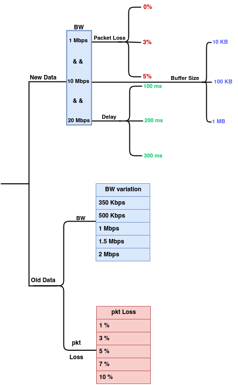

# Video_Streaming_Log

We present two types of video streaming logs, collected under different
Adaptive Bitrate (ABR) algorithms — <strong>BOLA</strong> and
<strong>Throughput-based</strong> — on the client side. The logs are intended
for analysis of video streaming Quality of Experience (QoE) under various
<strong>Congestion Control Algorithms (CCAs)</strong> and
<strong>network conditions</strong>.

<h2>Log Categories</h2>

<h3>1. <code>Paper_Video_Streaming_Log</code></h3>

These logs were used in the research paper and cover experiments conducted
with the following Congestion Control Algorithms:

<ul>
  <li>BBR</li>
  <li>BBRv2</li>
  <li>Cubic</li>
  <li>Reno</li>
</ul>

Each CCA was evaluated under diverse network conditions:

<strong>(a) Bandwidth Variations</strong>

<ul>
  <li>1 Mbps</li>
  <li>10 Mbps</li>
  <li>20 Mbps</li>
</ul>

<strong>(b) Buffer Sizes</strong>

<ul>
  <li>10 KB</li>
  <li>100 KB</li>
  <li>1 MB</li>
</ul>

<strong>(c) Network Delays</strong>

<ul>
  <li>100 ms</li>
  <li>200 ms</li>
  <li>300 ms</li>
</ul>

<strong>(d) Packet Loss Rates</strong>

<ul>
  <li>0%</li>
  <li>3%</li>
  <li>5%</li>
</ul>

<h3>2. <code>Old_Video_Streaming_Log</code></h3>

These logs were collected in a separate setup using
<strong>Mahimahi</strong> to emulate a virtual network environment.
The same CCAs — BBR, BBRv2, Cubic, and Reno — were tested. The bitrate is
consistent with that used in the paper, and the video duration for each log
is <strong>15 minutes</strong>.

<strong>(a) Packet Loss Variations</strong>

<ul>
  <li>1%</li>
  <li>3%</li>
  <li>5%</li>
  <li>7%</li>
  <li>10%</li>
</ul>

<strong>(b) Bandwidth Conditions (with 0% packet loss)</strong>

<ul>
  <li>350 Kbps</li>
  <li>500 Kbps</li>
  <li>1 Mbps</li>
  <li>1.5 Mbps</li>
  <li>2 Mbps</li>
</ul>

<h2>ABR Algorithms Used</h2>

<ul>
  <li><strong>BOLA</strong></li>
  <li><strong>Throughput-based</strong></li>
</ul>

Both log sets include performance data for these ABR algorithms to compare
QoE under identical network and CCA conditions.

<h2>Mahimahi Network Emulation</h2>

The Mahimahi-based experiments use the
<strong>car.snaroya-smestad</strong> trace from the MMSys 2013
path-bandwidth trace collection.

<strong>Trace source:</strong> 
<a href="https://skuld.cs.umass.edu/traces/mmsys/2013/pathbandwidth/car.snaroya-smestad/">
https://skuld.cs.umass.edu/traces/mmsys/2013/pathbandwidth/car.snaroya-smestad/
</a>

The trace provides separate uplink and downlink network conditions and is
used with Mahimahi's <code>mm-link</code> for trace-driven network emulation.

<h3>Trace Setup</h3>

Download the corresponding <code>.up</code> and <code>.down</code> trace files
and specify their locations in the experiment script:

<pre><code>UPLINK="/path/to/car-snaroya-smestad.up"
DOWNLINK="/path/to/car-snaroya-smestad.down"</code></pre>

The trace can be started using:

<pre><code>mm-link "$UPLINK" "$DOWNLINK" -- bash</code></pre>

<h2>Network Configuration</h2>

In addition to the Mahimahi trace, the experiment applies Linux
<strong>tc/netem</strong> to introduce controlled network conditions.
The configuration used for the random-loss experiment is:

<ul>
  <li><strong>Rate:</strong> 20 Mbps</li>
  <li><strong>Delay:</strong> 100 ms</li>
  <li><strong>Packet loss:</strong> 3%</li>
  <li><strong>Packet-loss model:</strong> Random/independent</li>
  <li><strong>TBF buffer:</strong> 1500 bytes</li>
  <li><strong>TBF queue limit:</strong> 10 MB</li>
  <li><strong>netem queue limit:</strong> 7000 packets</li>
</ul>

<h3>tc/netem Configuration</h3>

<pre><code>sudo tc qdisc add dev ingress root handle 1: tbf \
    rate 20mbit \
    buffer 1500 \
    limit 10MB

sudo tc qdisc add dev ingress parent 1:1 handle 30: netem \
    limit 7000 \
    delay 100ms \
    loss random 3%</code></pre>

<h2>Packet Loss Model</h2>

The configuration uses:

<pre><code>loss random 3%</code></pre>

This specifies a <strong>random/independent packet-loss model</strong>
with a nominal loss probability of 3%. It does <strong>not</strong>
represent bursty or temporally correlated packet loss.

Therefore, the experiments should be interpreted as evaluations under
<strong>random packet-loss conditions</strong>. Real wireless networks may
also exhibit bursty or correlated losses due to fading, interference,
mobility, and changing channel conditions.

Consequently, the current configuration should not be considered a complete
model of all wireless environments.

<h2>Reproducibility</h2>

The complete network configuration is provided in:

<pre><code>network_setup_random_loss.sh</code></pre>

Make the script executable:

<pre><code>chmod +x network_setup_random_loss.sh</code></pre>

Run the experiment using:

<pre><code>./network_setup_random_loss.sh</code></pre>

Before execution, update the trace and log paths in the script according to
your local system.

<h2>Repository Structure</h2>

<pre><code>.
├── README.md
├── Dataset.png
├── run-server.sh
├── Paper_Video_Streaming_Log/
└── Old_Video_Streaming_Log/</code></pre>

</body>
</html>
